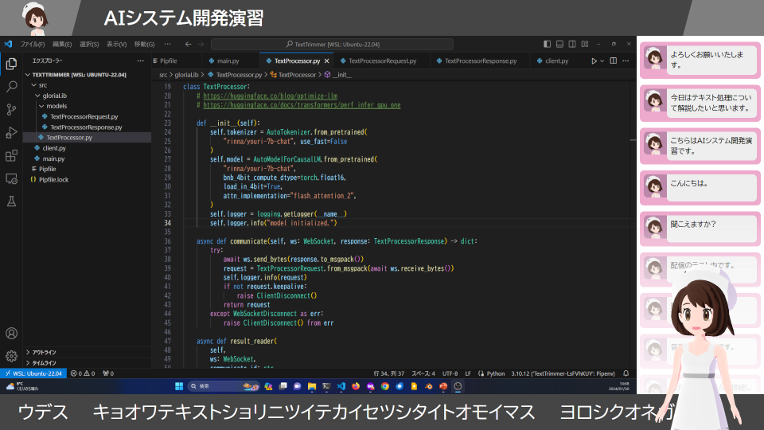

# Sincromisor

Webブラウザ上でかわいいキャラになっておしゃべりしたり、かわいいキャラとおしゃべりしたりできるよ!



## 必要なもの

* サーバー側
  * Linuxサーバー
  * Transformersが動作するNVIDIA GPU
    * シンクロモード: VRAM 8GBは必須、12GB以上推奨
    * チャットモード: 追加で8GB程度のVRAMが必要(Dify用)
  * [Docker Engine](https://docs.docker.com/engine/install/ubuntu/)
  * [NVIDIA Driver(nvidia-open)](https://www.nvidia.com/en-us/drivers/)
  * [NVIDIA Container Toolkit](https://docs.nvidia.com/datacenter/cloud-native/container-toolkit/latest/install-guide.html)
* クライアント側
  * GPUがそこそこの性能のPC、スマートフォン、タブレット
  * マイク
  * カメラ
  * Webブラウザ

## 検証済み環境

* サーバー側(シンクロモード)
  * ubuntu 24.04
    * Core i5-12600K
    * RTX3060(12GB)
    * DDR4-3200 64GB

* サーバー側(チャットモード)
  * ubuntu 24.04
    * Core i5-14500
    * RTX4060Ti(16GB)
    * DDR5-5600 64GB

* クライアント側
  * Windows 11(Ryzen 2500U)
  * Pixel 6
  * iPad Air(gen3)

## とにかくローカル環境でサーバーを動かす

最初に、NVIDIA DriverとContainer Toolkitが正常に動作し、`nvidia-smi`コマンドでGPUの状態を見れるところまでをがんばってください。

Sincromisorのシンクロモードは、[docker compose](https://docs.docker.com/compose/)を用いると、比較的簡単に実行できます。

まずはソースコードを入手します。

```sh
$ git clone https://github.com/Phenomer/Sincromisor.git
$ cd Sincromisor
```

設定ファイル`.env`を、`configs/.env.example-docker`を参考に作成します。
とりあえず動かしたいだけであれば、そのままコピーする形で構いません。

```sh
$ cp configs/.env.example-docker .env
$ chmod 600 .env
```

`docker compose build`でイメージをbuildします。
`--profile full`を指定すると、必要なコンテナ全てがビルドされます。

```sh
$ docker compose --profile full build
```

`docker compose up`で実行します。

```sh
$ docker compose --profile full up -d
```

## クライアント側のつかいかた

サーバーを実行したら、[http://localhost](http://localhost) にアクセスします。

* `Simple Interface`: キャラクターとテロップ、タイムラインのみが表示
* `Single Display`: Simpleの内容に加え、画面はめ込み用のプレースホルダがひとつ
* `Double Display`: Simpleの内容に加え、画面はめ込み用のプレースホルダがふたつ
* `Looking Glass`:  キャラクターを[Looking Glass](https://lookingglassfactory.com/looking-glass-portrait)で表示
* `Character Test`: キャラクターの動作テスト(音声認識・合成なし)

## チャットモードを利用する

チャットモードで利用したい時は、別途[Dify](https://dify.ai/jp)が必要となります。
また、Dify上でローカルLLMを利用したい場合は、[Ollama](https://ollama.com/)などが必要となります。

Difyでてきとうにチャットボットを作成したら、そのURLとAPIキーを`configs/.env`ファイルに記入し、コンテナを再起動してください。

```sh
SINCRO_PROCESSOR_DIFY_URL=http://127.0.0.1/v1
SINCRO_PROCESSOR_DIFY_TOKEN=app-W3Ef43iyPCBVfz47UDwGTHKU
```

## 処理を分散させる

VRAM不足などで全てのワーカーコンテナを同じホスト内で動作させることができない場合や、
ユーザー数の増加によりひとつのホストで全ての要求を捌ききれない場合は、
各ワーカーを異なるホスト上で動作させることができます。

## docker composeを用いないで実行する

* [Sincromisor実行環境のインストールとサーバーの起動](INSTALL.md)を参照してください。

## OBSで利用する場合

### カメラ・マイクの利用許可

デフォルトではブラウザソースのカメラ・マイク利用許可ダイアログの操作ができません。
そのため、コマンドラインで自動的に許可するようにする必要があります。
そのままではデバッグコンソールなども利用できないため、ついでにリモートデバッグポートも開けておくと便利です。

```bat
cd "C:\Program Files\obs-studio\bin\64bit"
obs64.exe --enable-media-stream ^
          --use-fake-ui-for-media-stream ^
          --auto-accept-camera-and-microphone-capture ^
          --autoplay-policy=no-user-gesture-required ^
          --remote-debugging-port=9222
```

### キャラクターの制御に利用するカメラ・マイクの設定

Chromeの設定を変えると、Chromium Embedded Framework側にも反映されるってBing AIが言ってました。
カメラについては、OBSで利用するカメラやキャプチャーボードと重複すると動作しなくなるので注意してください。

* <chrome://settings/content/camera>
* [chrome://settings/content/microphone](chrome://settings/content/camera)

## 音声認識・合成をコマンドラインで使いたい

[SincromisorCLI](https://github.com/Phenomer/SincromisorCLI)を用いると、
コマンドライン経由での音声認識・合成・テロップ用テキストの取得ができます。
